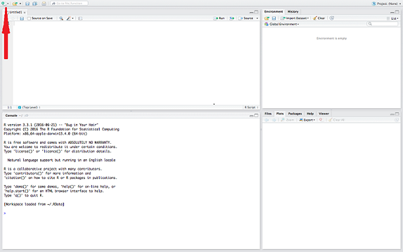
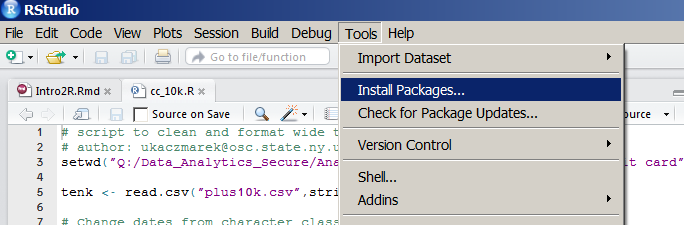
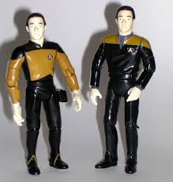
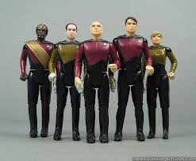
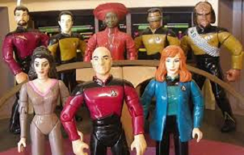

```{r setup, include=FALSE}
knitr::opts_chunk$set(echo = FALSE)
```

----
<h2>what is R?</h2> 

>- <h4>programming language with origins in statistical computing</h4>
>- <p>ack! To use R I have to _**learn how to code**_??!!
   but I've never coded before and I don't look anything like this guy:</p>
   <center>  </center>
>- <h4>yes, you will have to learn to code, but good news! lots of people from many different disciplines are learning to code every day and there are lots of places where you can learn on your own for free</h4>
  <p>we'll review some tools to help you as you take the next steps</p>

----
<h2>why should i bother learning it?</h2> 
<p></p>
>- <h3>data manipulation and cleaning</h3>
  <p>formatting, standardization, reshaping</p>
>- <h3>statistical analysis</h3>
  <p>summary stats, models, algorithms</p>
>- <h3>data visualization</h3>
  <p>static (base, ggplot2) and interactive (Shiny)</p>
>- <h3>presentation</h3>
  <p>create dashboards, PDFs, websites and slides just like these ioslides</p>  
>- <h3>it makes collaboration, editing, sharing, and replication easier!!!</h3> 
  <p>code runs the same every time. code documents steps. code is portable and copyable.</p>
  
---- 
<h2>neat! how do we get started?</h2>
<p></p>
>- <h3>your first stop:</h3> 
  <p>[R's homepage](https://www.r-project.org)</p>

>- <h3>your second stop:</h3> 
  <p>[RStudio IDE](https://www.rstudio.com)</p>

>- <h3>R is open source and comes with some preloaded functions</h3>
  <p>RStudio (also open source) provides a better working environment</p>
  <p>some of the best features (and datasets) are found in packages</p>

>- <h3>download packages from the R package ecosystem (CRAN)</h3>
  <p>**C**omprehensive **R** **A**rchive **N**etwork</p> 

>- <h3>let's familiarize ourselves with RStudio </h3>

----
<h4>open up a new R script</h4> 
<center></center>
<h4>script and data panel:<span style="color:#ed2354">draft your code and look at your datasets here</span></h4>
<h4>environment and history:<span style="color:#ed2354">active datasets & functions, record of code run</span></h4>
<h4>file, plot, packages, help:<span style="color:#ed2354">package & function info & graphics display here</span></h4>
<h4>console:<span style="color:#ed2354">the command line to run code immediately</span></h4>

----
<h2>how do I install and use packages?</h2>
<p></p>
<h3>from the command line (R IS CASE SENSITIVE!)</h3> 
```{r, eval = FALSE, echo = TRUE, prompt = TRUE}
install.packages("stringr") # installs the package in your library 
                          ## (don't forget the quotes!)

library(stringr) # loads the package for that R session 
                ## (with or without quotes)
``` 
<h3>from the RStudio tools menu </h3>

----
<h2>let's talk data!</h2>
<h3>the most basic data structure in R is the one-dimensional vector. there are two kinds:</h3>
>- <p>atomic vectors (homogeneous) and lists (heterogeneous)</p>
<center>&nbsp;</center>
>- <p>atomic vector types: logical (including NA), integers, double (numeric, including two part numbers like decimals, exponents, etc.)), characters</p>
>- <p>lists: elements are a combination of any data structure, including other lists</p> 

----
<h2>let's talk data!</h2>
<h3>more on atomic vectors:</h3>
<p>often created with concatenation (R will coerce elements of different types into a single type)</p>
```{r, eval = FALSE, echo = TRUE, prompt = TRUE}
# let's create atomic vectors of length three
x <- c("a", "character", "string") # atomic vector of type character
y <- c(1.0, 2.5, 3) # atomic vector of type numeric
z <- c(1L, 2, 3) # atomic vector coerced to numeric
tf <- c(TRUE, FALSE, 1) # atomic vector coerced to numeric
typeof(tf)
class(tf)
length(tf)
```
<h3>most R coders prefer to use ( <- ) as their operator. ( = ) also works, but lets keep that one for passing parameters inside functions</h3>
<p>the RStudio shortcut for creating the <- operator is (ALT)(-)</p>

----
## {.build}
<h3>let's create some more atomic vectors and assign them to variables</h3>
<h3>1: a character string of length one with your name
assign it to a variable called 'my.name'</h3>
<p>do we need the c() function if its a vector of length one?</p>
```{r, eval = FALSE, echo = TRUE, prompt = TRUE}
my.name <- "first.name last.name"
``` 

<h3>2: the character string "my name is" and assign it to a variable called 'intro'</h3>
```{r, eval = FALSE, echo = TRUE, prompt = TRUE}
intro <- "my name is"
``` 

<h3>3: a third string called 'my.intro': paste together intro and my.name using the str_c function</h3>
<p>remember you don't have to write out your strings again</p>
<p>how do we evenly space all parts of the string?</p>

```{r, eval = FALSE, echo = TRUE, prompt = TRUE}
my.intro <- str_c(intro, my.name, sep = " ")
``` 

----
## {.build}
<h2>let's talk data!</h2>
<h3>more on lists:</h3>
```{r, eval = FALSE, echo = TRUE, prompt = TRUE}
#let's create a list of length three
x <- list("list", "of", 3)
class(x)
is.list(x)
is.atomic(x)
length(x)
```
<h3>let's make a list out of our my.name and intro variables and call it my.intro.list</h3>
```{r, eval = FALSE, echo = TRUE, prompt = TRUE}
my.intro.list <- list(intro, my.name)
```
<h3>what is the biggest difference between my.intro and my.intro.list?</h3>
```{r, eval = FALSE, echo = TRUE, prompt = TRUE}
my.intro
my.intro.list
```

----
<h2>let's talk data!</h2>
<h3>data of multiple dimensions: </h3>
>- <p>matrices and arrays (homogeneous) are vectors with added rows and columns often used with algebraic functions, etc.</p>
<p>data frames (heterogeneous) are the most commonly used structure to store data</p>   <center>&nbsp;</center>
>- <h3>we'll later discuss these classes in greater detail</h3>

----
<h2>let's talk objects</h2>
<h3> as we've seen, you create vectors and other data structures in R through assignment:</h3>
```{r, eval = FALSE, echo = TRUE, prompt = TRUE}
# object is a vector of class character
captains <- c("Kirk", "Picard", "Janeway") 

# object is a data frame
shows <- data.frame(character = captains,
                    show = c("Star Trek", "TNG", "Voyager"),
                    show.order = c(1,2,3), stringsAsFactors = FALSE)
``` 

>- <h3>objects are also actions that R can perform. these are called expressions</h3>
>- <h3>so pretty much everything in your R enviro is an object, even parts of functions</h3> 

----
<h2> I want to learn more!</h2>
<br></br>
<h3> The Swirl library is a great place to start </h3>
<p> swirlstats.com</p>

```{r, eval = FALSE, echo = TRUE, prompt = TRUE}
install.packages("swirl")
library(swirl)
``` 

----
<h2> Want to relive the magic? Visit GitHub! </h2>
<p></p>
<center>  </center>
>- <h3>THE online space to collaborate on projects that run on code</h3>
    <p>stored in project-specific repositories (repos)</p>
>- <h3>The GitHub repo for this workshop has the script (classcode.R) for the slides and a script of the code we ran</h3>
   <h4>[https://github.com/ursulakaczmarek/Rlab](https://github.com/ursulakaczmarek/Rlab)</h4>
