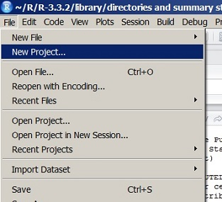
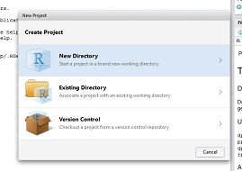
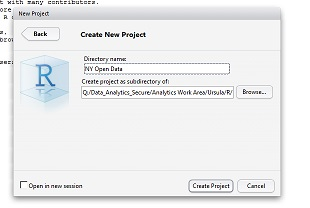

```{r setup, include=FALSE}
knitr::opts_chunk$set(echo = FALSE)
```

---
###managing projects in R
###keep organized all those data frames, objects, and R scripts
RStudio allows us to manage the data, code, and workspace associated with a particular project  

- head to File in the menu bar
<center> </center>

*****
###managing projects in R
- create a project in a new working directory
we can establish a working directory on shared drives, which aids collaboration!
<center> </center>
- select 'Empty Project', name your directory 'NYC Open Data' and save it as a subdirectory to your desktop 
<center> </center>
- a new blank workspace will open up

*****
###a new project, new datasets 
we can load data directly into R from the NY State and NYC Open Data Catalogs

```{r, eval = FALSE, echo = TRUE, prompt = TRUE}
# importing online data directly into R using RSocrata
install.packages("RSocrata")
library(RSocrata)
## identify API endpoint for the dataset
## specify search terms just like in SQL
url <- "https://data.cityofnewyork.us/
resource/qiz3-axqb.json?$where=number_of_cyclist_injured > 0"

# read the dataset into R
wrecks <- read.socrata(url)

# read in ZIP code demographic data using alternative method
## it's a small dataset so no need to specify search terms
download.file("https://data.cityofnewyork.us/resource/rreq-n6zk.csv", 
              "demo.by.zip.csv")
demographics <- read.csv("demo.by.zip.csv")
```

*****
###cleaning our data
examining the structure of our dataset tells us everything except the date field was imported as character types

```{r, eval = FALSE, echo = TRUE, prompt = TRUE}
str(wrecks)

```

```{r, eval = FALSE, echo = TRUE, prompt = TRUE}
# coercing to proper data types
wrecks[, c(3:10, 17, 20)] <- sapply(wrecks[, c(3:10, 17, 20)], as.numeric)

## examine again
str(wrecks)
summary(wrecks)
```

*****
###summary stats
averages, maximums, sum totals

```{r, eval = FALSE, echo = TRUE, prompt = TRUE}
## average number of persons killed per wreck indexed by borough
tapply(wrecks$number_of_persons_killed, wrecks$borough, mean)

## maximum number of fatalities indexed by borough
tapply(wrecks$number_of_persons_killed, wrecks$borough, max)

## total number of fatalities indexed by borough
tapply(wrecks$number_of_persons_killed, wrecks$borough, sum)

## total number of cyclists killed per wreck indexed by borough
tapply(wrecks$number_of_cyclist_killed, wrecks$borough, sum)
```

*****
###summary stats

Tukey's five number distribution (median, first/third quartiles, min, max)
```{r, eval = FALSE, echo = TRUE, prompt = TRUE}
tapply(wrecks$number_of_persons_injured, wrecks$borough, fivenum)
```

don't forget our frequency tables
```{r, eval = FALSE, echo = TRUE, prompt = TRUE}
table(wrecks$borough, wrecks$contributing_factor_vehicle_1)
table(wrecks$contributing_factor_vehicle_1, wrecks$number_of_persons_killed)
```

*****
###summary stats

###chi-square test of independece
is there an association between the two categorical variables? is the distribution of the data due entirely to chance?  
using two-way contingency table frequencies (observed counts and counts expected if two variables are independent)  
the p-value tells us the probability of getting resulting chi-square value

```{r, eval = FALSE, echo = TRUE, prompt = TRUE}
## note data not randomized, code to demo syntax & output
chi.table <- xtabs(~contributing_factor_vehicle_1 + vehicle_type_code1, data = wrecks)
summary(chi.table)
```

*****
###as always, class slides and practice code are available at:
[https://github.com/ursulakaczmarek/Rlab](https://github.com/ursulakaczmarek/Rlab)

<center> </center>
